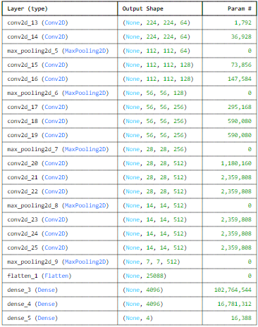
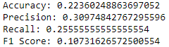
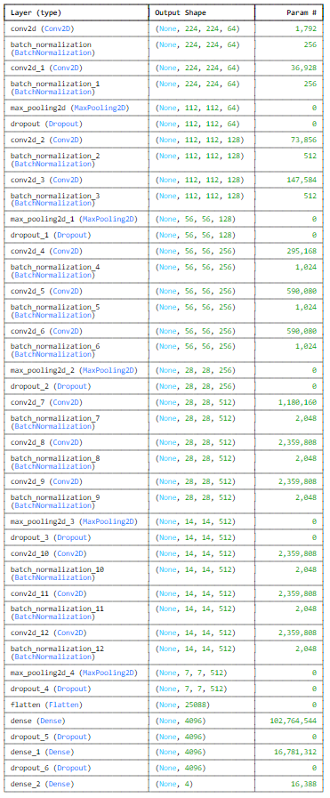
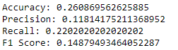

# Fruit-Image-Detection

#### Dataset Link: [FruitDataset](https://www.kaggle.com/datasets/corneliuskarel/data-uts-2-0-1/settings)

## Objective

Utilize a pre-trained VGG16 model to accurately recognize and categorize photos of different fruits, the next step would be improving the VGG16 model such that it can reliably distinguish between different fruit varieties even in a variety of background and lighting situations.Examine the VGG16 model's recall, accuracy, and precision on a test dataset to make sure it satisfies requirements appropriate for practical use. 

## Business Opportunity

Accurate fruit identification and classification can improve quality control, expedite inventory management, and lower manual labor expenses in the retail and agriculture industries. Businesses can benefit greatly from automated fruit identification and categorization systems since they allow for quicker processing times, reduce errors, and guarantee consistency in the evaluation of fruit quality. In order to enable both retail automation and agricultural surveillance, this project fills a requirement for a dependable, automated fruit recognition system that can distinguish between various fruit varieties in photos. 

## Methodologies

-The baseline model is a simplified VGG16 architecture is used to construct the baseline model, which consists of convolutional layers followed by max-pooling layers. The model concludes with fully linked layers and a softmax activation for classification, with each layer using ReLU activation. The model can distinguish between different kinds of fruits thanks to its architecture, which is made to learn the key characteristics in the fruit photos.

-The tuned model builds upon the baseline by adding Batch Normalization after each convolutional layer to stabilize and accelerate training. Dropout Regularization is incorporated to prevent overfitting, with dropout layers placed after each max-pooling layer and in the fully connected layers. These modifications make the model more robust, improving its ability to generalize on unseen images.

## Baseline Model & Results

#### Baseline Model Architecture
VGG16 Model 

 

#### Baseline Result

## Tuned Model & Results

#### Tuned Model Architecture
These modifications make the model more robust, improving its ability to generalize on unseen images.

 

#### Tuned Model Results

## Conclusion

evaluations are improved generally, F1 Score is increased decently with the new modified model, which we added dropouts and batch normalizations, proving that our modified model succeed on improving the prior model's predicting power for the test set. However, by reducing the batch size because there is a limitation in computing power, the external gpu used from kaggle returns exhaustion error.

